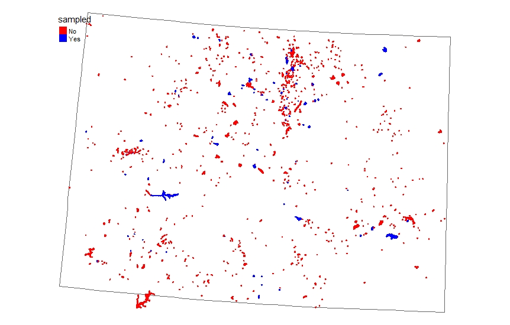
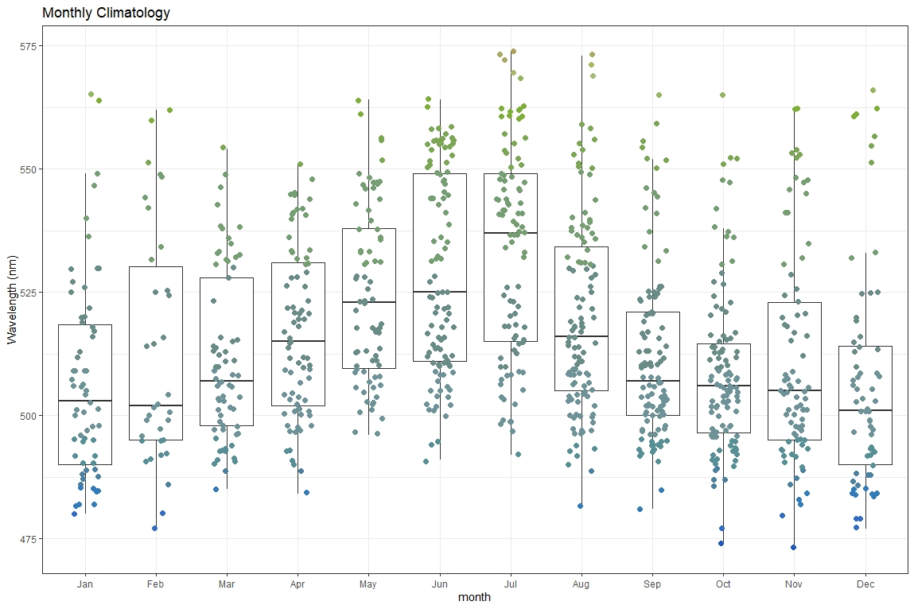
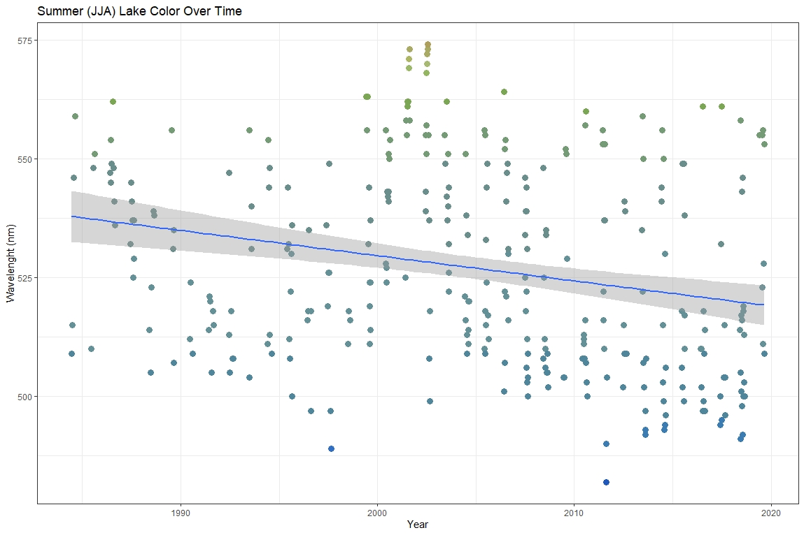

```{r setup, echo=FALSE}
library(knitr)
opts_chunk$set(engine.path='venv/bin/python3')
```

```{python, include=FALSE}
from plots import *
```


# Motivation

Algae blooms are becoming more relevant in today’s world, due to the increasing 
climate change. Scientific research has shown that algae blooms are happening at
an increasing frequency, with a higher geographic distribution than we had 
previously seen, which is especially notable in high elevation reservoirs. Not 
only are algae blooms occurring more frequently, harmful algal blooms - also 
known as HABS - are also occurring more frequently.  

Even though algae are natural and part of a healthy freshwater ecosystem, the
algae can grow to an extent that it can be harmful to the ecosystem – creating 
anoxic conditions for example, otherwise known as “dead zones” for the aquatic 
fauna. The HABs can produce toxins that can be harmful to not only the aquatic 
ecosystem, but to humans and other animals, such as dogs. Both algae blooms and 
HABs have a wide range of impacts that can not only be local, but they can also
have interstate impacts. This is especially important to note because Lake Erie,
in 2014, had a HAB that was incredibly impactful to the local economy and 
residents. The HAB left half-a-million people without clean water to drink and 
roughly \$65 million in economic losses over a two day span of time.
            
With the increasing use of reservoirs for municipalities, the quality of the 
water is very important. Although the water gets treated before it gets to the 
tap, the quality of the water as it reaches the water treatment plant is very 
important regarding the cost to treat the water for municipal use, and algal 
blooms impact the quality of the water dramatically(Brookes). Most municipal water is 
monitored, but not all of the data is publicly available and some isn’t 
monitored in situ - otherwise known as collected by hand. 

We will use two distinct datasets: satellite data and in situ data from public
sources. The satellite data were downloaded from Google Earth Engine, which
downloaded the data for individual lakes, ignoring images that were over a
threshold of cloud cover. This threshold was because cloud cover would darken
the pixels, skewing the data. The satellite data included all of Landsat 5, 7,
and 8 from the past 35 year and has the different band (wavelength) data for the
center most pixel of each lake. The in situ data includes all public data that
is available for chlorophyll in Colorado. This includes data from sources like
Denver Water, the USGS, and Northern Water. The data that is being utilized is
chlorophyll values, which act as a proxy for algae blooms. 



Landsat is a series of satellites that image the Earth surface, in repeated 
intervals of 14  days; that is to say an individual location such as Fort Collins gets
re-imaged every 14 days. Landsat 5 dates back to 1984, and is no longer taking images,
while landsat 7 (1999) and landsat 8 (2013) still record images today. The landsat
imagery allows for a larger sample of data to look at the trends of algal blooms in
Colorado, in comparison to the lack of public in situ data available. \ref{fig:map}
shows reservoirs - only those greater than 0.01 km² -  that have both in situ and
satellite imagery in blue, while the reservoirs in red indicate the reservoirs with 
just the landsat imagery available. It is easy to see the lack of reservoir data we have 
available to us, which is why utilizing machine learning to try and predict 
algae blooms from just remotely sensed imagery would be an incredibly useful
method of determining water quality in reservoirs. It has been done previously,
but mainly utilizing only the blue and green wavelengths, despite there being more
potential options(Sachidananda).

{width=75%}

{width=75%}

We attempted to detect algae blooms from satellite images by using statistical learning
methods to approximate the relationship between features in satellite images and in situ
chlorophyll measurements from various lakes in Colorado (predominantly municipal water
sources such as Horsetooth Reservoir). We reduced the satellite images to a set of
key features that are likely to be associated with algae blooms; red, green, and blue
wavelength range measurements, dominant wavelength, and various infrared range measurements.
We joined these data to in situ chlorophyll measurements and fit various non-parametric
models before finally producing chlorophyll estimates for all available satellite images.


# Methods


## Data Interpolation (Merging Shift Threshold)

Satellite image data and in situ data were not collected on similar schedules.
This meant that many observations were lost from both datasets on an inner join.
To remedy this problem, a procedure was used referred to as a "merge threshold."
Using a merge threshold, the satellite data were shifted forward and backward $0,
1, \cdots, n$ days. For example, on a merge threshold of two, the in situ data
from any single observation on day $k$ would be used on day $k - 2, k - 1, k, k
+ 1$, and $k + 2$. In other words, the data from any single in situ observation
would be used for the surrounding four days, but each in situ observation would
only be included once. The merge threshold procedure was done up to ten days of
threshold. 

However, the aforementioned approach certainly fails after a
certain range of days. The optimal shift was determined experimentally: Each
model was fit using data shifted from one to ten days in either direction, and
the cross-validation error was used to assess model accuracy. The specifics of
the experimental structure are described below. The model accuracy provided a
picture of the quality of interpolation provided by each shift. If data was
shifted too many days, the prediction accuracy of the algorithm should
deteriorate.


## Response Variable Transformation

As can be seen from Figure \ref{fig:resp-hist}, the chlorophyll variable, the response
variable in this case, was initially highly skewed. This had an impact on
initial prediction accuracy. In order to correct for the skewed nature of the
data, the response was log-transformed, yielding the second distribution in
Figure \ref{fig:resp-hist}.

```{python, echo=FALSE, fig.cap="Distribution of chlorophyll before and after log transformation.\\label{fig:resp-hist}"}
plot_histograms()
```

It should be noted that all MSE values were calculated from chlorophyll on the
log-transformed scale, then exponentiated to account for the variable
transformation.


## Models

The algae bloom data is spatiotemporal; the blooms are recorded in a certain
geographic location at a certain time. This makes the class of linear models
unsuitable for this problem. Linear models make assumptions about the structure
of the errors in the data generating process that are violated by spatiotemporal
data. Spatiotemporal data have errors which are correlated; as observations
closer in space or time will vary together.

The models selected were tree-based: Random Forest, Boosted Trees, and XGBoost. Although
the classical formulation of Random Forests and Boosted Trees rely on the
assumption of independent and identically distributed observations, tree-based
models were chosen in hopes that the extra flexibility in these models would
help account for the temporal structure in the data. 

The Random Forest and Boosted Tree implementation from `scikit-learn` were used.
The XGBoost implementation was taken from the Python package `xgboost`.


## Model Selection

The chosen models were fit on a grid of parameters. The parameters altered were
merge threshold, variable subset, and type of model. That is, we fit every
possible combination of merge threshold from $0, \cdots, 10$, the selected
variable subsets, and the selected model types. 

Within each of the aforementioned combinations, a training set and test set were
created from the merged data, with the training set compromising two-thirds of
the dataset, and the test set compromising one-third of the dataset.  

After a training and test set were created, $5$-fold cross-validation was
performed. Models were compared via $5$-fold cross validation error on the
training dataset. The final model was selected via this error, and then results
were reported on the test data set.


# Results

Overall, random forest, gradient boost, and XGBoost performed similarly, with random forest
performing slightly better than the other two model types. 


## Feature subsets and importance

Performance for all three models generally improved as more features were added.
The inclusion of the lake area feature resulted in the largest performance improvement.
\ref{fig:feature-importance} shows the feature importance statistics for a random forest
model fit to a dataset constructed with a merge threshold of 3 days and including all features.

```{python, echo=FALSE, fig.cap="Feature importance from random forest with all features included.\\label{fig:feature-importance}"}
plot_feature_importance()
```


## Merge Shifting Threshold

When comparing results across different merge threshold values, we see all three model
types perform similarly.

```{python, echo=FALSE, fig.cap="Cross-validation error for all three models at merge thresholds from 1 to 10.\\label{fig:thresh-performance}"}
plot_thresh_performance()
```

As we can see from Figure \ref{fig:thresh-performance}, the trend across merge
thresholds for each model is very similar. Generally, performance decreases before increasing
and staying relatively high. It interesting to note that a shift of one day performed worse 
than no shift, or a shift of two days. This is a counter-intuitive result,
but it could be due to the tradeoff between the extra volume of data added by
larger shift thresholds versus the accuracy of the data at lower shifting
thresholds.


## Model Performance

All three models mentioned performed similarly, with no model greatly exceeding
the other two in terms of CV error. The best overall model, in terms of CV MSE
error, was a random forest with a merge shift threshold of three days, that
included all features. The best model had a CV MSE of approximately 1.75, and a
test set MSE of approximately 1.09.


## Predicted Values

Finally, we generated chlorophyll estimates for each of the available satellite images,
including satellite images of lakes for which there is no available in situ data.
\ref{fig:predicted-values} Shows the estimated chlorophyll value against the dominant
wavelength of the satellite image. We can see that the highest chlorophyll estimates
are attributed to satellite images which have a green dominant wavelength. However, we
are generating predictions of chlorophyll values exceeding $70 \frac{\mu g}{mL}$, which
is most likely unreasonable. This is likely an artifact of the extreme observations included
in the training data with chlorophyll measurements exceeding $300 \frac{\mu g}{mL}$.

```{python, echo=FALSE, fig.cap="Predicted values vs. dominant wavelength.\\label{fig:predicted-values}"}
plot_predicted_values()
```

## Conclusion

We have described a process for using non-parametric machine learning methods to estimate
chlorophyll concentrations in lakes from satellite images. This process broadly consists of
these steps.

1. Collect satellite image data.
2. Process satellite image data to create features.
3. Associate image features with in situ measurements, allowing some small number of days in error.
4. $\log$-transform the chlorophyll measurements to unskew the distribution.
5. Fit a model to these data, with $\log$-transform chlorophyll measurements as the response variable and satellite features as the predictor variables.
6. Use this model to generate predicted $\log (\text{chlorophyll})$ values for each satellite image.
7. Exponentiate the predicted values to return them to original scale.

Using this process, we investigated the effectiveness of different model types, feature subsets,
and merge threshold values and found the best results with a random forest model using all features
and a merge threshold value equal to three days. This model had a 5-fold cross validation MSE of 
1.75, and the MSE on the holdout test set was 1.05. Based on these error measurements,
we have demonstrated that these models are capable of estimating chlorophyll concentrations
with practical accuracy. This level of accuracy is likely at least partially attributable to the fact
that the training data includes repeated sampling of a handful of lakes, and as a result the error
measurements are measuring the model's ability to estimate chlorophyll concentrations from *unseen*
images of *familiar* lakes. To evaluate the predictive accuracy of these models on *unfamiliar* lakes,
an analyst would require a dataset observing a much larger number and range of lakes. As mentioned
previously, only measurements from municipal water sources were available.

In future exploration, we hope to address the extreme predicted values by removing observations with a
chlorophyll concentration exceeding $15 \frac{\mu g}{mL}$. We expect this change to result in a much
more reasonable range of predicted values. We also think that, based on the importance of the lake area
feature, the inclusion of a feature describing lake elevation will be important. Lastly, although we
included indicators for month to account for variance in time, we wish to repeat the analysis including
spatial features such as latitude and longitude to account for variance in space.


## Sources

Brezonik, Patrick, Kevin D. Menken, and Marvin Bauer. “Landsat-Based Remote
Sensing of Lake Water Quality Characteristics, Including Chlorophyll and Colored
Dissolved Organic Matter (CDOM).” Lake and Reservoir Management 21, no. 4 
(December 2005): 373–82. https://doi.org/10.1080/07438140509354442.

Brookes, J. D., and C. C. Carey. “Resilience to Blooms.” Science 334, no. 6052 
(October 7, 2011): 46–47. https://doi.org/10.1126/science.1207349.

Brookes, Justin D., Cayelan C. Carey, David P. Hamilton, Lionel Ho, Leon van der
Linden, Robert Renner, and Anna Rigosi. “Emerging Challenges for the Drinking 
Water Industry.” Environmental Science & Technology 48, no. 4 (February 18, 
2014): 2099–2101. https://doi.org/10.1021/es405606t.

Folke, Carl, Steve Carpenter, Brian Walker, Marten Scheffer, Thomas Elmqvist,
Lance Gunderson, and C.S. Holling. “Regime Shifts, Resilience, and Biodiversity 
in Ecosystem Management.” Annual Review of Ecology, Evolution, and Systematics 
35, no. 1 (December 15, 2004): 557–81. 
https://doi.org/10.1146/annurev.ecolsys.35.021103.105711.

Ho, Jeff C., Anna M. Michalak, and Nima Pahlevan. “Widespread Global Increase in
Intense Lake Phytoplankton Blooms since the 1980s.” Nature 574, no. 7780 
(October 2019): 667–70. https://doi.org/10.1038/s41586-019-1648-7.

Olmanson, Leif G, Marvin E Bauer, and Patrick L Brezonik. “Use of Landsat
Imagery to Develop a Water Quality Atlas of Minnesota’s 10,000 Lakes.” 
Conference Proceedings, 2002, 8.

Scheffer, Marten, Steve Carpenter, Jonathan A. Foley, Carl Folke, and Brian 
Walker. “Catastrophic Shifts in Ecosystems.” Nature 413, no. 6856 (October 2001)
591–96. https://doi.org/10.1038/35098000.

Torbick, Nathan, Sarah Hession, Stephen Hagen, Narumon Wiangwang, Brian Becker, 
and Jiaguo Qi. “Mapping Inland Lake Water Quality across the Lower Peninsula of
Michigan Using Landsat TM Imagery.” International Journal of Remote Sensing 34,
no. 21 (November 10, 2013): 7607–24. https://doi.org/10.1080/01431161.2013.822602.
