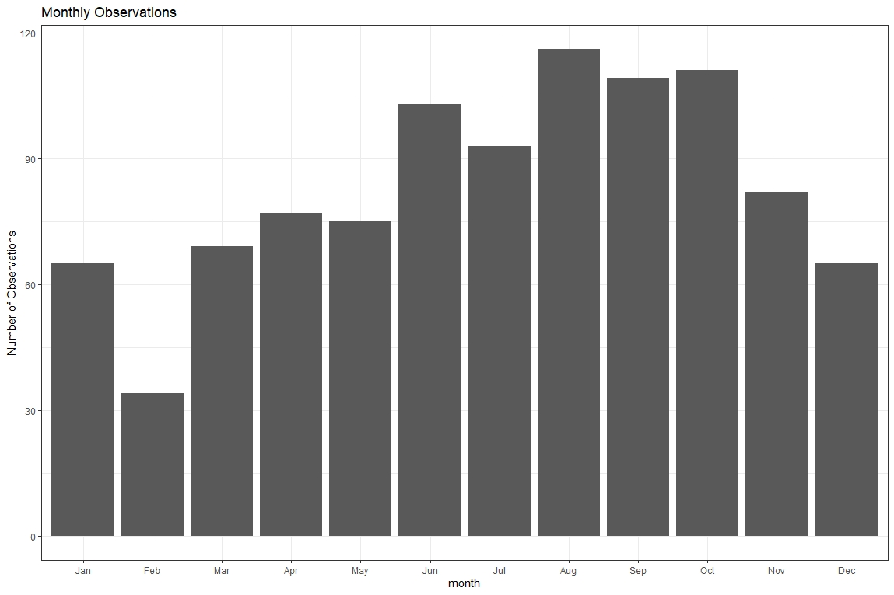
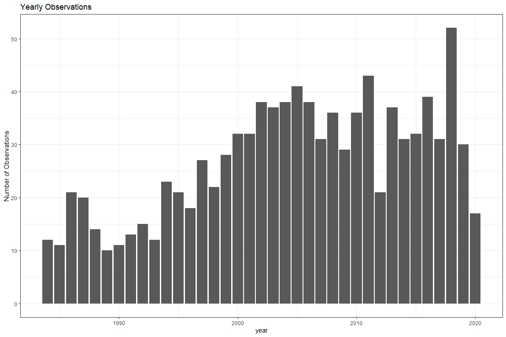
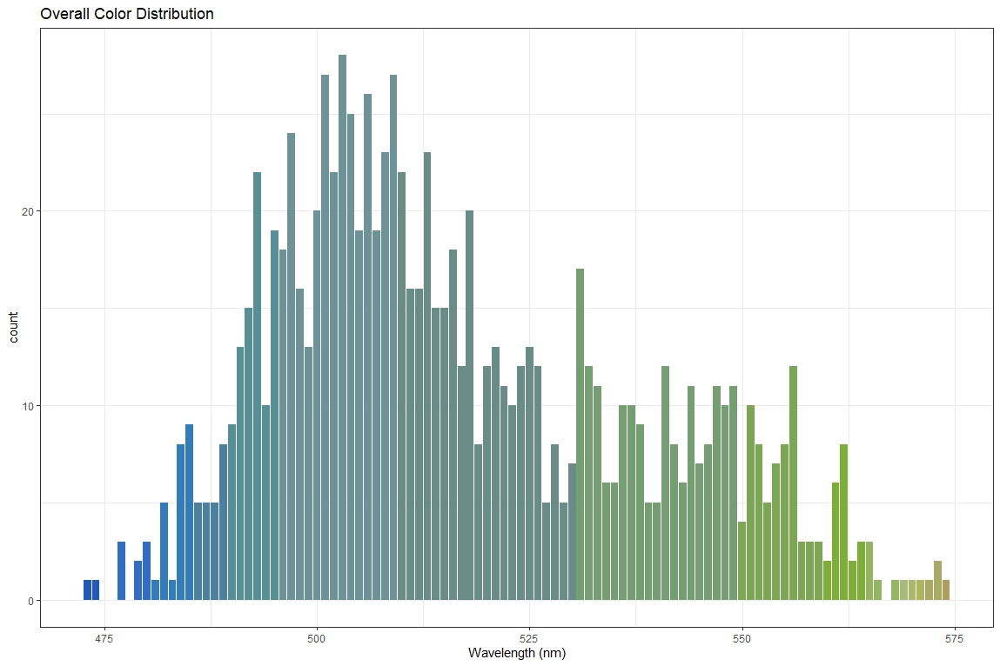
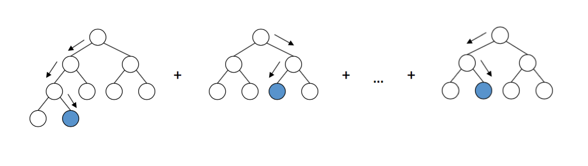

```{r setup, echo=FALSE}
library(knitr)
opts_chunk$set(engine.path='venv/bin/python3')
```

```{python, include=FALSE}
from plots import *
```

## Motivation

When looking at the amount of hand-collected (in situ) data, we see that in
Colorado only has data for the major municipal water bodies like Horsetooth.


## Where did the data come from?

We are utilizing satellite data that was gathered from GEE & all in situ public
water quality data for Colorado.
  - The satellite images are collected every 14 days.
  - In situ data is collected randomly.


## A look at the monthly data




## A look at the yearly data




## The use of remote sensing data

Landsat data can provide us with valuable data that can show us what the
conditions of the reservoirs are at any given time. This data, like the
blueness or greenness of a reservoir, can help us look at reservoirs that we do
not have data for.




## Climatology by month

We can see that Horsetooth is more green and has higher wavelengths in the
summer months. This trend is why we only care about summer months.


## Summer Months

- Over time, during the summer, Horsetooth is becoming more blue. 
- This is not the case for all reservoirs; some are actually becoming more
  green. 
- The greener they are, the more suspected algae is in the water.


## Merge Threshold

- In-situ and satellite data do not necessarily have matching dates
- On an inner join, most of the data would be dropped
- Solution: Shift in-situ data $0, \cdots, n$ days forward and backward

## Response Variable Transformation

Because of extreme skew, the response variable, chlorophyll, was
log-transformed.

```{python, echo=FALSE}
plot_histograms()
```

## Model selection

- Final model was selected via 5-fold cross-validation error on a training set.
- Models were fit over a grid of:
  1. Model type
  1. Variable Subset
  1. Merge Threshold
  
## Algorithm Choice

- The algae bloom data is spatiotemporal: We have measurements that are
  potentially correlated over geographic space, that are taken over time
- This means we cannot use any regression-based methods. Assumptions about
  uncorrelated errors are violated.
- Solution: Non-parametric algorithms

## Algorithm Choice, Cont.

- We chose two non-parametric algorithms:
  - Random Forest
  - Gradient Boosting



Image credit: https://arogozhnikov.github.io/2016/06/24/gradient_boosting_explained.html
  
## Gradient Boosted Trees

- Given a differentiable loss function $L(\cdot)$, we want to **minimize** the total loss for points in the test set:

  $$\sum_{i = 1}^{n} L(y_i, F(x_i))$$

  Where $F(y_i, F(x_i))$ is a measure of how **wrong** $F(x_i)$ is in predicting $y_i$.

- This leads to an optimization problem, which (because of differentiability) can be solved by gradient descent.

## Gradient Boosted Trees, cont.

- We can interpret residuals as the **negative gradient** of the total loss.
- Here, we use the default implementation in `scikit-learn`, which has a
  least-squares loss function:

$$L(y_i, F(x_i)) = (y_i - F(x_i))^2$$


## Random forest feature importance

- We were surprised to see `areasqkm` as the most important feature
- `dwl` as the second most important feature makes sense

```{python, echo=FALSE}
plot_feature_importance()
```


## How does the feature subset affect performance?

- Different models behave similarly
- Adding in `areasqkm` resulted in the biggest performance increase

```{python, echo=FALSE}
plot_subset_performance()
```


## How does the merge threshold affect performance?

- Different models behave similarly
- Interestingly, a merge threshold of 1 is worse than 0 and 2

```{python, echo=FALSE}
plot_thresh_performance()
```


## Results summary

- Our best model was a random forest with a merge threshold of 3 days and included all available features
- Our best model received a CV MSE of about 1.75 and a test set MSE of about 1.09


## Predicted values

```{python, echo=FALSE}
plot_predicted_values()
```

